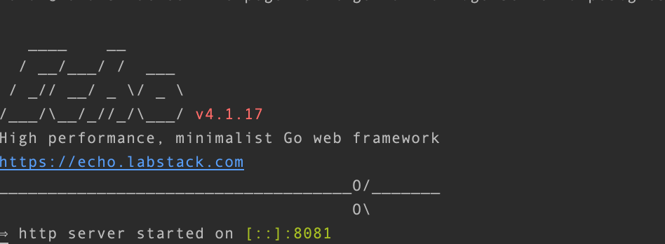
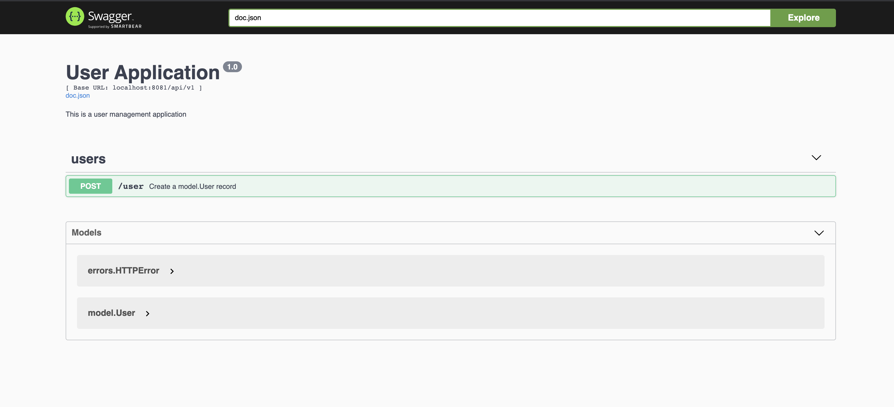
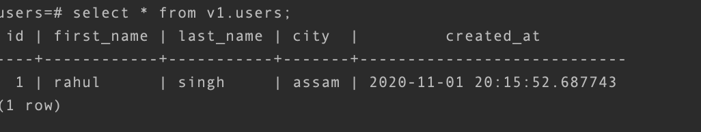

# pogoREST - _REST Over Postgres_

### Introduction 

**pogoREST** is the RESTful API over a postgres data base written in Go. It uses [swagger](https://swagger.io/) to design UI and document APIs at scale.

### Project Layout

```
├── main.go                             # main function of the program.
├── README.md                           # README for the project.
├── makefile                            # Makefile (or makefile), defines set of tasks to be executed.
├── .gitignore                          # files/folders to be ignored pushing to git.
├── go.mod                              # go.mod is the module definition file.
├── go.sum                              # go.sum contains all the dependency checksums, and is managed by the go tools
├── docker-compose.yml                  # docker-compose file starting both db and rest service
├── Dockerfile                          # Dockerfile to build rest service docker image
├── Dockerfile.db                       # Dockerfile.db build postgres container
├── init.sh                             # script to create databases and tables
├── cmd                                 # commands and base commands are placed here.
│   ├── api.go                          # api for all the database operations.
│   ├── root.go
│   └── version.go
├── connection                          # connections details for db.
│   └── postgres.json
├── db                                  # data base connectivity code.
│   └── db.go                   
├── docs                                # swagger auto generated docs are stored here.
├── erros                               # custom errors defined for pogoREST.
│   └── erros.go
├── handlers                            # rest api implementations are happened here
│   ├── handler_interface.go
│   ├── handler.go
│   └── handler_test.go
├── model                               # structs and data models for the project.
│   ├── user.go
│   ├── user_test.go
├── static                              # all the images for readMe.md file.
└── version                             # keeps track of version for a project. 
    └── version.go
```

### Implementations

pogoREST uses
 
- [echo](https://github.com/labstack/echo) for the rest api implementations. All the installations details can be found
[here](https://github.com/labstack/echo#installation).

- [swag](https://github.com/swaggo/swag) converts Go annotations to Swagger Documentation 2.0. All the installations and 
implementations can be found [here](https://github.com/swaggo/swag#getting-started).

- [sqlx](https://github.com/jmoiron/sqlx) to connect and perform operations over database/sql.


### Build PogoREST

pogoREST can be built using various options:

- `make build` will build executable file
- `make build-docker` will build a docker container of the applications.

### Run PogoREST

Check if the db container is up and running:

```
docker ps        #you should be able to see db container informations if running
docker exec -it <docker-container-name>
su postgres      # username to connect
psql             # it will open the terminal for postgres
```

Make sure the db connection details is fed to `connection/postgres.json`.

`docker-compose up -d` - Spins up postgres container and then the application container.

Once the docker-compose runs successfully the application will run exposing port `8081`.




Go to browser and enter `http://localhost:8081/swagger/index.html`. You should be able to see:



Once you enter the expected requested and run execute you will be able to see the record in DB:




 